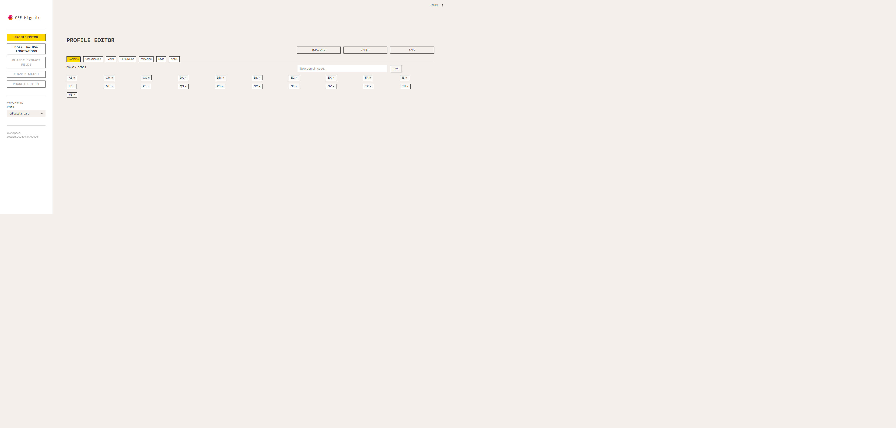
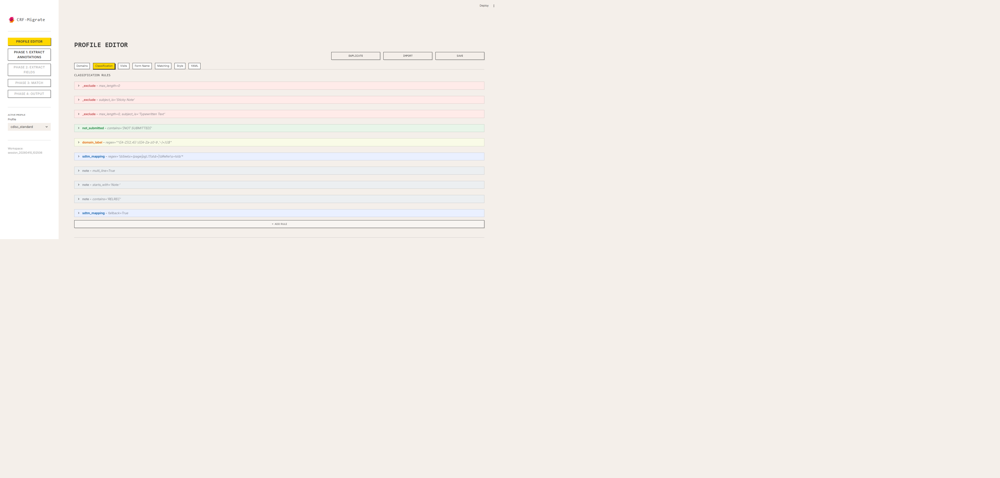
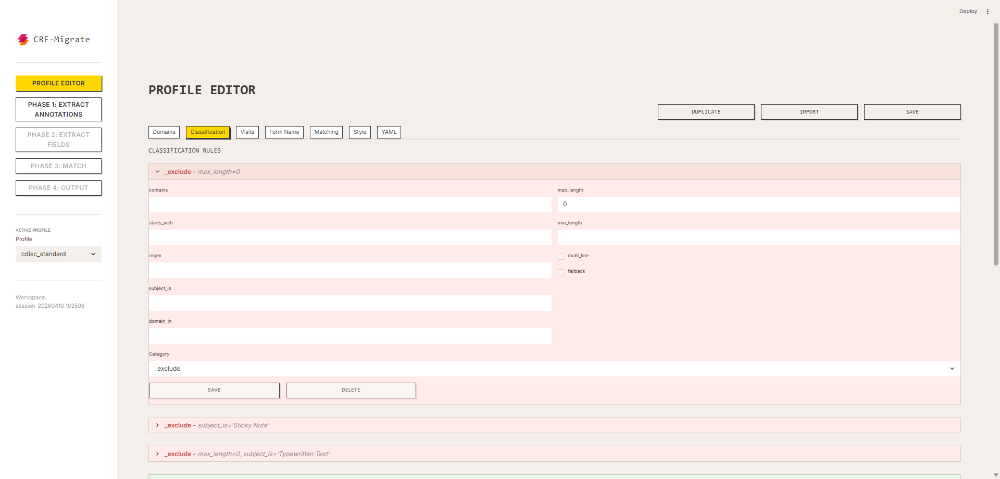
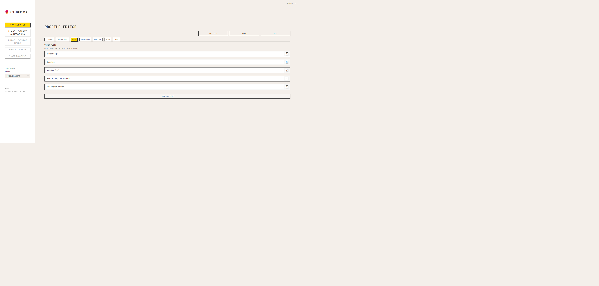
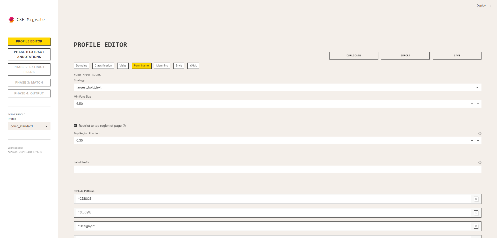
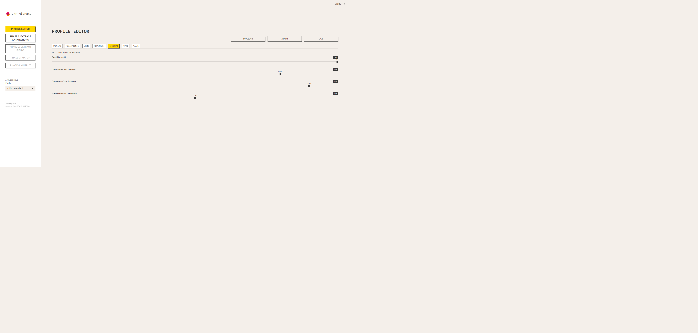
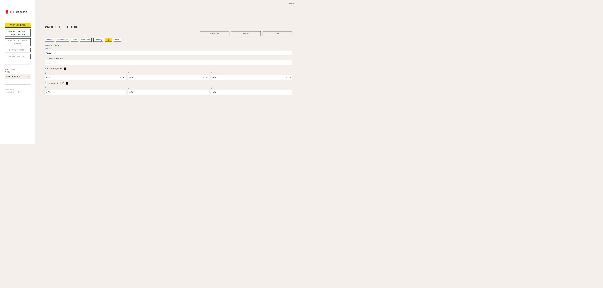
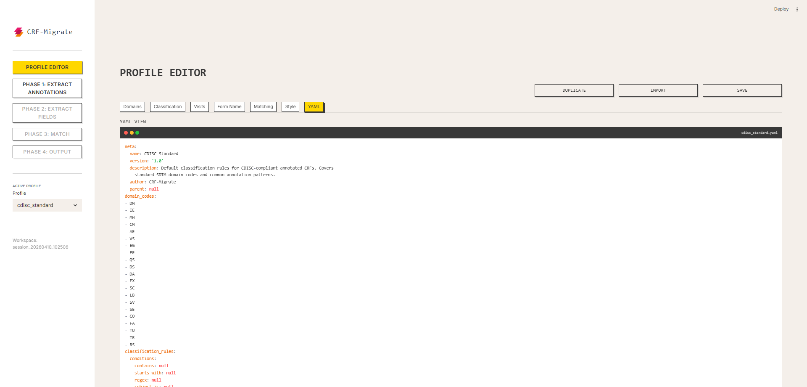

# CRF-Migrate

A Python desktop tool for migrating SDTM annotations between annotated CRF (aCRF) PDF versions in clinical trials. Built with a Streamlit UI and a configurable YAML rule engine — no code changes are needed when adapting to new CRF formats or EDC systems.


## Overview

When a study updates its blank CRF between versions, all SDTM annotations from the previous annotated CRF must be manually re-applied to the new version — a time-consuming and error-prone process. CRF-Migrate automates this by:

1. **Extracting** existing SDTM annotations from the source aCRF PDF
2. **Extracting** form fields from the new blank target CRF PDF
3. **Matching** annotations to fields using exact, fuzzy, and position-based strategies
4. **Writing** approved annotations onto the target PDF with full style preservation

All classification and matching behavior is controlled by YAML profiles. The same codebase handles CDISC standard, Medidata Rave, Veeva Vault, and any custom EDC layout — just swap the profile.

## Installation

**Requirements:** Python 3.10+

```bash
git clone https://github.com/linm1/CRF-Migrate.git
cd CRF-Migrate
pip install -e .
```

### Optional: virtual environment

```bash
python -m venv .venv
# Windows
.venv\Scripts\activate
# macOS/Linux
source .venv/bin/activate

pip install -e .
```

## Usage

```bash
streamlit run app.py
```

The app opens at `http://localhost:8501`. Follow the phase-locked navigation in the sidebar:

| Step | Page | What you do |
|------|------|-------------|
| 0 | Profile Editor | Select or configure a YAML profile for your EDC system |
| 1 | Phase 1 | Upload source aCRF PDF → extract annotations → review/edit |
| 2 | Phase 2 | Upload target CRF PDF → extract fields → review/edit |
| 3 | Phase 3 | Run matching → review results → approve/reject/assign |
| 4 | Phase 4 | Generate output aCRF → download PDF + QC report |

Each phase writes a JSON artifact to the session workspace. Editing a phase automatically invalidates all downstream phases.

## Project Structure

```
CRF-Migrate/
├── app.py                    # Streamlit entry point
├── ui/
│   ├── components.py         # Shared widgets, PDF utilities, phase invalidation
│   ├── profile_editor.py     # Profile selector, rule editor, rule tester
│   ├── loader.py             # Loading animation (SMIL SVG)
│   ├── phase1_review.py      # Annotation extraction & review
│   ├── phase2_review.py      # Field extraction & review
│   ├── phase3_review.py      # Match dashboard, approve/reject, manual assign
│   └── phase4_review.py      # Output generation & QC report
├── src/
│   ├── models.py             # Pydantic v2 data models (Annotation/Field/MatchRecord)
│   ├── profile_models.py     # Profile schema (Pydantic v2)
│   ├── profile_loader.py     # YAML load, validation, inheritance resolution
│   ├── rule_engine.py        # Stateless rule evaluation (no PDF/UI dependencies)
│   ├── extractor.py          # Phase 1: extract annotations from source PDF
│   ├── field_parser.py       # Phase 2: extract fields from target PDF
│   ├── matcher.py            # Phase 3: 4-pass matching algorithm
│   ├── writer.py             # Phase 4: write annotations to target PDF
│   ├── session.py            # Session workspace & audit log management
│   └── csv_handler.py        # CSV import/export for all record types
├── profiles/
│   ├── cdisc_standard.yaml   # Default CDISC profile
│   ├── rave_medidata.yaml    # Medidata Rave profile
│   └── veeva_vault.yaml      # Veeva Vault profile
└── tests/                    # 354 tests, 94% coverage
```

## Profiles

Profiles are the only mechanism for adapting to different CRF formats. No code changes are ever needed.

### Built-in profiles

| Profile | Description |
|---------|-------------|
| `cdisc_standard` | Default — CDISC-compliant annotation patterns |
| `rave_medidata` | Medidata Rave EDC conventions |
| `veeva_vault` | Veeva Vault EDC conventions |

## Profile Editor

The Profile Editor is the control center for adapting CRF-Migrate to any EDC system. Access it from the sidebar — it is always available regardless of phase status.

### Toolbar

Three buttons appear at the top right of the editor:

| Button | What it does |
|--------|-------------|
| **DUPLICATE** | Clones the active profile under a new name — use this to create a custom profile based on a built-in one |
| **IMPORT** | Loads a YAML file from disk as a new profile |
| **SAVE** | Validates and persists all unsaved changes to the profile YAML file |

> Changes are held in a draft until you click **SAVE**. Navigating away without saving discards the draft.

### Switching profiles

Use the **Profile** dropdown in the sidebar to switch between profiles. The active profile name is shown below the dropdown.

---

### Tab: Domains



The **Domains** tab manages the list of SDTM domain codes recognized by the rule engine.

**To add a domain code:**
1. Type the code (e.g. `SUPPAE`) in the text field
2. Click **+ ADD**
3. The new badge appears in the grid

**To remove a domain code:**
- Click the **×** on any badge

Domain codes are used by `classification_rules` with the `domain_in` condition — rules that match annotations whose text references a known domain.

---

### Tab: Classification



The **Classification** tab defines how each annotation is categorized. Rules are evaluated top-to-bottom; the first matching rule wins.

**Rule categories and their colors:**

| Category | Color | Meaning |
|----------|-------|---------|
| `sdtm_mapping` | Blue | Standard SDTM variable annotation |
| `domain_label` | Yellow | Domain header label (e.g. `AE (Adverse Events)`) |
| `not_submitted` | Green | "Not submitted" placeholder annotation |
| `note` | Gray | Informational note annotation |
| `_exclude` | Red | Annotation is filtered out entirely |

**To expand a rule:** Click the arrow to the left of a rule row to reveal its conditions and controls.



**Available conditions:**

| Condition | Example | Description |
|-----------|---------|-------------|
| `contains` | `[NOT SUBMITTED]` | Text contains this substring |
| `starts_with` | `Note:` | Text starts with this prefix |
| `regex` | `^([A-Z]{2,4})` | Full Python regex match |
| `subject_is` | `Sticky Note` | PDF annotation subject field equals this |
| `domain_in` | *(uses domain_codes list)* | Annotation text references a known domain |
| `max_length` | `0` | Text length is at most N characters |
| `min_length` | `5` | Text length is at least N characters |
| `multi_line` | `true` | Text contains a newline |
| `fallback` | `true` | Always matches — place last as a catch-all |

> Within one rule, all conditions use AND logic. For OR logic, create separate rules.

**To add a rule:** Click **＋ ADD RULE** at the bottom of the list.

**Rule Tester:** Below the rule list, paste sample annotation text and an optional domain/subject to see which rule fires and what category is assigned — useful for validating regex patterns before saving.

---

### Tab: Visits



The **Visits** tab maps regex patterns to visit names. These are used by the extractor to tag annotations with the visit they appear on.

Each row is a `pattern → visit_name` mapping. Patterns are Python regexes matched against page header text.

---

### Tab: Form Name



The **Form Name** tab configures how the form name is extracted from each CRF page (Phase 2).

| Setting | Description |
|---------|-------------|
| **Strategy** | `first_bold_text` |
| **Top region fraction** | Fraction of page height to scan (e.g. `0.15` = top 15%) |
| **Label prefixes** | Prefixes to strip (e.g. `Form:`, `CRF:`) |
| **Exclude patterns** | Regex patterns that should never be treated as a form name |

---

### Tab: Matching



The **Matching** tab exposes the four confidence thresholds used by the Phase 3 matching algorithm.

| Threshold | Default | Description |
|-----------|---------|-------------|
| **Exact threshold** | 1.00 | Confidence assigned to exact form + field matches |
| **Fuzzy same-form threshold** | 0.80 | Minimum `token_sort_ratio` for same-form fuzzy matches |
| **Fuzzy cross-form threshold** | 0.90 | Minimum `token_sort_ratio` for cross-form fuzzy matches |
| **Position fallback confidence** | 0.50 | Confidence assigned to coordinate-scaled position matches |

Raise fuzzy thresholds to reduce false positives; lower them to increase recall on heavily reformatted CRFs.

---

### Tab: Style



The **Style** tab controls how annotations look in the output PDF.

| Setting | Description |
|---------|-------------|
| **Font size** | Point size for `sdtm_mapping` / `note` annotations |
| **Domain label font size** | Point size specifically for `domain_label` annotations |
| **Text color (R, G, B)** | RGB floats 0.0–1.0 for annotation text |
| **Border color (R, G, B)** | RGB floats 0.0–1.0 for annotation border/fill |

The color swatch next to each row shows a live preview of the current color.

> Default: black text `[0, 0, 0]`, black border `[0, 0, 0]` — matching the standard aCRF convention. Supposed to stick with default as per MSG.

---

### Tab: YAML



The **YAML** tab shows the full resolved profile as a live preview (terminal aesthetic). Use it to:
- Verify that edits have the correct structure before saving
- Download the profile YAML for external editing or version control

Click **Download** to save the current draft as a `.yaml` file.

## Matching Algorithm

Phase 3 runs four cascading passes. Each pass only processes annotations not yet matched by a previous pass:

1. **Exact** — same `form_name` + identical `anchor_text`/`label` (case-insensitive)
2. **Fuzzy same-form** — `rapidfuzz token_sort_ratio` within the same form (default threshold: 80%)
3. **Fuzzy cross-form** — same algorithm across all remaining fields (default threshold: 90%)
4. **Position fallback** — coordinate scaling from source to target page dimensions; domain labels use absolute placement

Each match record carries a `confidence` score, `match_type`, and `status` (approved / re-pairing).

## CSV Workflow

All three record types support CSV round-trips for bulk editing outside the app:

```
Export CSV → edit in Excel/Numbers → Import CSV → review changes in app
```

- **Annotations CSV**: all fields including `rect`, `style`, `anchor_rect` (JSON-serialized)
- **Fields CSV**: all fields including `rect`
- **Matches CSV**: all fields including `target_rect`, `field_id` (blank = unmatched)

## Session Workspace

Each app session creates a `sessions/session_<timestamp>/` directory containing:

```
annotations.json      # Phase 1 output
fields.json           # Phase 2 output
matches.json          # Phase 3 output
output_acrf.pdf       # Phase 4 output
qc_report.json        # Phase 4 QC summary
audit_log.json        # Timestamped record of all user actions
active_profile.yaml   # Snapshot of the profile used in this session
source_acrf.pdf       # Uploaded source PDF
target_crf.pdf        # Uploaded target PDF
```

## Development

```bash
# Install dev dependencies
pip install -e ".[dev]"

# Run all tests
pytest

# Run with coverage
pytest --cov=src --cov-report=term-missing

# Run a single test file
pytest tests/test_matcher.py -v
```

### Test coverage by module

| Module | Coverage |
|--------|----------|
| `models.py` | 100% |
| `profile_models.py` | 100% |
| `matcher.py` | 99% |
| `field_parser.py` | 99% |
| `rule_engine.py` | 99% |
| `writer.py` | 95% |
| `profile_loader.py` | 91% |
| `pdf_utils.py` | 89% |
| `session.py` | 89% |
| `csv_handler.py` | 89% |
| `extractor.py` | 84% |
| **Total** | **94%** |

## License

PyMuPDF (used for PDF annotation read/write) is licensed under **AGPL-3.0**. If AGPL is not acceptable for your use case, `pypdf` (BSD-3-Clause) can be substituted with reduced annotation fidelity.

All other project code is provided as-is for internal/research use.
